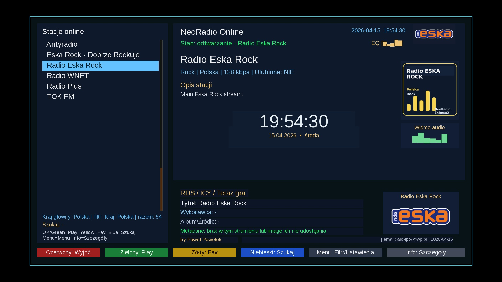

# NeoRadio

**NeoRadio** is a modern **Enigma2 internet radio plugin** focused on fast online radio playback, country-based browsing, SAT/IPTV picon support, bilingual Polish/English UI and GitHub-based updates.



## Overview

NeoRadio was created for users who want a clean and practical internet radio experience directly on Enigma2 receivers.  
The plugin combines a modern interface, large station database, picon support, metadata display and a built-in update mechanism.

It is designed for everyday use on real receivers, with emphasis on:
- speed,
- readability,
- remote control navigation,
- country-based station browsing,
- compatibility with Enigma2 images.

## Main features

- online radio playback inside Enigma2
- country-based station list
- main country selection for default startup view
- bilingual interface: **Polish / English**
- automatic language mode:
  - Polish when Enigma2 system language is Polish
  - English in all other cases
- manual language switch in plugin settings
- favorites support
- station search
- metadata display:
  - RDS / ICY / Now Playing
- SAT/IPTV picon support
- picon matching by:
  - station name
  - aliases
  - bouquet service reference
- custom fallback radio icon when no picon is found
- elegant central clock in the main screen
- built-in screensaver with moving clock
- GitHub update support using remote `manifest.json`
- `.ipk` package build support
- repository structure ready for further development and releases

## User interface

NeoRadio provides:
- clear station list on the left side
- station details panel
- metadata section
- picon / fallback preview
- visual audio spectrum
- central clock widget
- color-button based navigation for Enigma2 remote control

The layout was prepared to work independently from the currently used Enigma2 skin as much as possible.

## Picon support

NeoRadio can load picons from local Enigma2 paths and bouquet-related references.

Supported matching methods include:
- exact station name
- name variants with and without separators
- aliases
- bouquet service references
- local picon paths
- optional direct image-based picon URL

If no correct picon is found, the plugin displays its built-in fallback radio graphic.

## Language support

NeoRadio supports two interface languages:
- **Polish**
- **English**

Language behavior:
- system Polish → plugin starts in Polish
- any other system language → plugin starts in English
- user can override this manually in plugin settings

## Screensaver

NeoRadio includes an optional built-in screensaver with:
- moving clock
- current station name
- clean dark overlay
- safe display for radio playback mode

## GitHub updates

The plugin supports update checking from a remote GitHub manifest.

Features:
- built-in manifest support
- update check from plugin menu
- version comparison
- download and installation of new `.ipk`
- GUI restart prompt after update

## Repository layout

```text
pkgroot/                                 Files installed on the Enigma2 receiver
release/CONTROL/control                  Package metadata template
release/build_ipk.sh                     Helper script to build the .ipk package
manifest.json                            GitHub update manifest
docs/images/                             Screenshots and README images
